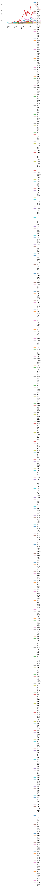
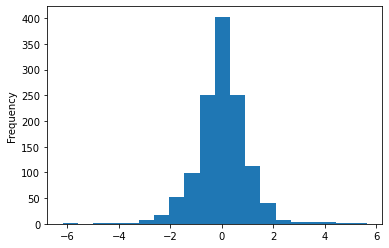
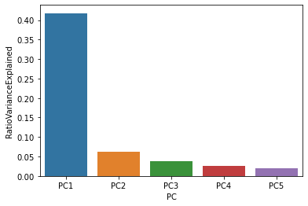
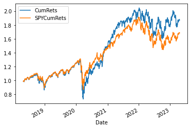
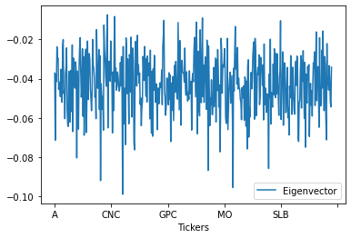
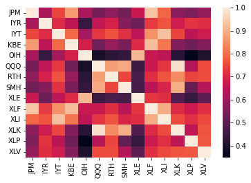
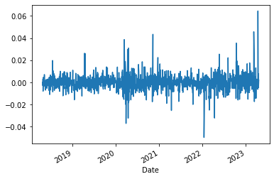
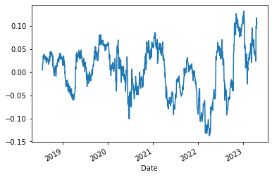
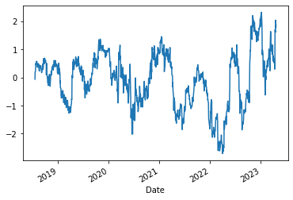
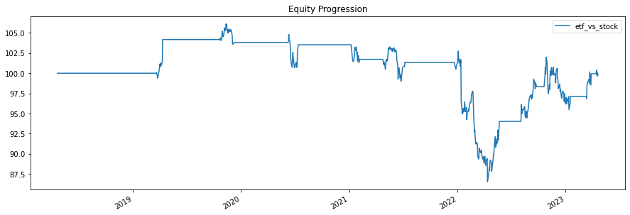

Implementation of a statistical arbitrage methodology outlined in Avellaneda (2008) "Statistical Arbitrage in the U.S. Equities Market".

We regress a given stock returns on a relevant ETF's returns and try to model the residuals as a mean-reverting O-U process. This serves as the basis for a signal on which we build a backtest.


```python
import pandas as pd
import numpy as np
import bs4 as bs
import requests
import yfinance as yf
import datetime
import seaborn as sns
from sklearn.decomposition import PCA
from sklearn.linear_model import Ridge
import statsmodels.api as sm
from sklearn.preprocessing import StandardScaler
from regressors import stats
import bt
import matplotlib.pyplot as plt
%matplotlib inline
```


```python
test = yf.download(['MSFT'])
```

    [*********************100%***********************]  1 of 1 completed
    


```python
test = test.reset_index()
```


```python
test['Ticker'] = 'MSFT'
```


```python
test['Date'].iloc[0]
```


    Timestamp('1986-03-13 00:00:00')


```python
test['ts'] = pd.Timestamp(test['Date'].iloc[0]) + pd.Timedelta('16H')
```


```python
test.rename(columns={'Date':'asof_date','Open':'open','Close':'close','High':'high','Low':'low','Volume':'volume',
                     'Ticker':'ticker','Adj Close':'adj_close'})
```


<div>
<style scoped>
    .dataframe tbody tr th:only-of-type {
        vertical-align: middle;
    }

    .dataframe tbody tr th {
        vertical-align: top;
    }

    .dataframe thead th {
        text-align: right;
    }
</style>
<table border="1" class="dataframe">
  <thead>
    <tr style="text-align: right;">
      <th></th>
      <th>asof_date</th>
      <th>open</th>
      <th>high</th>
      <th>low</th>
      <th>close</th>
      <th>adj_close</th>
      <th>volume</th>
      <th>ticker</th>
      <th>ts</th>
    </tr>
  </thead>
  <tbody>
    <tr>
      <th>0</th>
      <td>1986-03-13</td>
      <td>0.088542</td>
      <td>0.101563</td>
      <td>0.088542</td>
      <td>0.097222</td>
      <td>0.060657</td>
      <td>1031788800</td>
      <td>MSFT</td>
      <td>1986-03-13 16:00:00</td>
    </tr>
    <tr>
      <th>1</th>
      <td>1986-03-14</td>
      <td>0.097222</td>
      <td>0.102431</td>
      <td>0.097222</td>
      <td>0.100694</td>
      <td>0.062823</td>
      <td>308160000</td>
      <td>MSFT</td>
      <td>1986-03-13 16:00:00</td>
    </tr>
    <tr>
      <th>2</th>
      <td>1986-03-17</td>
      <td>0.100694</td>
      <td>0.103299</td>
      <td>0.100694</td>
      <td>0.102431</td>
      <td>0.063907</td>
      <td>133171200</td>
      <td>MSFT</td>
      <td>1986-03-13 16:00:00</td>
    </tr>
    <tr>
      <th>3</th>
      <td>1986-03-18</td>
      <td>0.102431</td>
      <td>0.103299</td>
      <td>0.098958</td>
      <td>0.099826</td>
      <td>0.062281</td>
      <td>67766400</td>
      <td>MSFT</td>
      <td>1986-03-13 16:00:00</td>
    </tr>
    <tr>
      <th>4</th>
      <td>1986-03-19</td>
      <td>0.099826</td>
      <td>0.100694</td>
      <td>0.097222</td>
      <td>0.098090</td>
      <td>0.061198</td>
      <td>47894400</td>
      <td>MSFT</td>
      <td>1986-03-13 16:00:00</td>
    </tr>
    <tr>
      <th>...</th>
      <td>...</td>
      <td>...</td>
      <td>...</td>
      <td>...</td>
      <td>...</td>
      <td>...</td>
      <td>...</td>
      <td>...</td>
      <td>...</td>
    </tr>
    <tr>
      <th>9348</th>
      <td>2023-04-17</td>
      <td>289.929993</td>
      <td>291.600006</td>
      <td>286.160004</td>
      <td>288.799988</td>
      <td>288.799988</td>
      <td>23836200</td>
      <td>MSFT</td>
      <td>1986-03-13 16:00:00</td>
    </tr>
    <tr>
      <th>9349</th>
      <td>2023-04-18</td>
      <td>291.570007</td>
      <td>291.760010</td>
      <td>287.010010</td>
      <td>288.369995</td>
      <td>288.369995</td>
      <td>20161800</td>
      <td>MSFT</td>
      <td>1986-03-13 16:00:00</td>
    </tr>
    <tr>
      <th>9350</th>
      <td>2023-04-19</td>
      <td>285.989990</td>
      <td>289.049988</td>
      <td>284.540009</td>
      <td>288.450012</td>
      <td>288.450012</td>
      <td>17150300</td>
      <td>MSFT</td>
      <td>1986-03-13 16:00:00</td>
    </tr>
    <tr>
      <th>9351</th>
      <td>2023-04-20</td>
      <td>285.250000</td>
      <td>289.029999</td>
      <td>285.079987</td>
      <td>286.109985</td>
      <td>286.109985</td>
      <td>23244400</td>
      <td>MSFT</td>
      <td>1986-03-13 16:00:00</td>
    </tr>
    <tr>
      <th>9352</th>
      <td>2023-04-21</td>
      <td>285.010010</td>
      <td>286.269989</td>
      <td>283.059998</td>
      <td>285.760010</td>
      <td>285.760010</td>
      <td>21665400</td>
      <td>MSFT</td>
      <td>1986-03-13 16:00:00</td>
    </tr>
  </tbody>
</table>
<p>9353 rows × 9 columns</p>
</div>


### Get all recent tickers of S&P500


```python
resp = requests.get('http://en.wikipedia.org/wiki/List_of_S%26P_500_companies')
soup = bs.BeautifulSoup(resp.text, 'lxml')
table = soup.find('table', {'class': 'wikitable sortable'})
tickers = []
for row in table.findAll('tr')[1:]:
    ticker = row.findAll('td')[0].text
    tickers.append(ticker)

tickers = [s.replace('\n', '') for s in tickers]
```


```python
len(tickers)
```


    503


```python
data = yf.download(["SPY"]+tickers, period = "5y")
```

    [*********************100%***********************]  504 of 504 completed
    
    2 Failed downloads:
    - BRK.B: No data found, symbol may be delisted
    - BF.B: No data found for this date range, symbol may be delisted
    

### Compute returns


```python
rets = data['Adj Close'].pct_change()
rets.dropna(inplace=True,axis=0, how='all')
rets.dropna(inplace=True,axis=1, how='any')

rets_SPX = pd.DataFrame(rets['SPY'])
rets.drop(['SPY'], axis=1, inplace=True)
```


```python
mu = rets.mean()
sig = rets.std()

z_rets = (rets - mu)/sig
```


```python
(1+rets).cumprod().plot()
```


    <AxesSubplot:xlabel='Date'>


    

    


```python
plt.show()
```


```python
z_rets['AAPL'].plot.hist(bins=20)
```


    <AxesSubplot:ylabel='Frequency'>


    

    


```python
pca = PCA(n_components=5).fit(rets)
```


```python
pcs = ['PC' + str(i) for i in range(1,51)]
explained_variance_ratio = pd.DataFrame(zip(pcs, pca.explained_variance_ratio_), columns=['PC', 'RatioVarianceExplained'])

```


```python
sns.barplot(data=explained_variance_ratio, x='PC', y='RatioVarianceExplained')
```


    <AxesSubplot:xlabel='PC', ylabel='RatioVarianceExplained'>


    

    


### Eigenportfolio returns


```python
w=abs(pca.components_[0])/sum(abs(pca.components_[0]))
eigenptf = pd.DataFrame(rets.dot(w.T), columns=['Returns'])
eigenptf['CumRets'] = (1+eigenptf['Returns']).cumprod()
eigenptf = eigenptf.join(rets_SPX, how='left')
eigenptf['SPYCumRets'] = (1+eigenptf['SPY']).cumprod()
eigenptf[['CumRets','SPYCumRets']].plot()
```


    <AxesSubplot:xlabel='Date'>


    

    


```python
pd.DataFrame(zip(rets.columns, pca.components_[0]), columns=['Tickers', 'Eigenvector']).plot(x='Tickers')
```


    <AxesSubplot:xlabel='Tickers'>


    

    


### Getting sectors ETF data


```python
etf_tickers = ['QQQ','IYR','IYT','OIH','KBE','RTH','SMH','XLE','XLF','XLI','XLK','XLP','XLV']
etf_data = yf.download(etf_tickers, period = "5y")
```

    [*********************100%***********************]  13 of 13 completed
    


```python
etf_data['Adj Close'].dropna()
```


<div>
<style scoped>
    .dataframe tbody tr th:only-of-type {
        vertical-align: middle;
    }

    .dataframe tbody tr th {
        vertical-align: top;
    }

    .dataframe thead th {
        text-align: right;
    }
</style>
<table border="1" class="dataframe">
  <thead>
    <tr style="text-align: right;">
      <th></th>
      <th>IYR</th>
      <th>IYT</th>
      <th>KBE</th>
      <th>OIH</th>
      <th>QQQ</th>
      <th>RTH</th>
      <th>SMH</th>
      <th>XLE</th>
      <th>XLF</th>
      <th>XLI</th>
      <th>XLK</th>
      <th>XLP</th>
      <th>XLV</th>
    </tr>
    <tr>
      <th>Date</th>
      <th></th>
      <th></th>
      <th></th>
      <th></th>
      <th></th>
      <th></th>
      <th></th>
      <th></th>
      <th></th>
      <th></th>
      <th></th>
      <th></th>
      <th></th>
    </tr>
  </thead>
  <tbody>
    <tr>
      <th>2018-04-23</th>
      <td>64.169640</td>
      <td>179.979111</td>
      <td>42.519604</td>
      <td>501.699036</td>
      <td>156.419937</td>
      <td>89.723495</td>
      <td>92.230774</td>
      <td>57.415947</td>
      <td>25.097010</td>
      <td>69.008354</td>
      <td>62.349861</td>
      <td>44.102707</td>
      <td>75.616608</td>
    </tr>
    <tr>
      <th>2018-04-24</th>
      <td>64.325768</td>
      <td>176.323212</td>
      <td>42.730320</td>
      <td>497.801331</td>
      <td>153.105850</td>
      <td>88.939896</td>
      <td>91.758720</td>
      <td>56.800922</td>
      <td>24.934795</td>
      <td>67.080017</td>
      <td>61.262974</td>
      <td>43.822865</td>
      <td>75.047745</td>
    </tr>
    <tr>
      <th>2018-04-25</th>
      <td>64.186996</td>
      <td>178.160629</td>
      <td>42.633739</td>
      <td>502.070251</td>
      <td>153.289413</td>
      <td>89.446365</td>
      <td>91.296097</td>
      <td>57.252460</td>
      <td>24.916773</td>
      <td>67.271942</td>
      <td>61.272430</td>
      <td>43.901569</td>
      <td>75.387222</td>
    </tr>
    <tr>
      <th>2018-04-26</th>
      <td>64.967636</td>
      <td>176.784927</td>
      <td>42.493267</td>
      <td>508.195343</td>
      <td>156.516556</td>
      <td>91.711205</td>
      <td>93.212662</td>
      <td>58.085476</td>
      <td>24.925787</td>
      <td>67.025192</td>
      <td>62.387672</td>
      <td>44.163921</td>
      <td>76.341476</td>
    </tr>
    <tr>
      <th>2018-04-27</th>
      <td>65.808990</td>
      <td>179.036865</td>
      <td>42.782997</td>
      <td>505.225616</td>
      <td>156.613190</td>
      <td>93.029968</td>
      <td>92.608421</td>
      <td>57.470451</td>
      <td>24.961832</td>
      <td>66.888115</td>
      <td>62.274246</td>
      <td>44.400047</td>
      <td>76.653458</td>
    </tr>
    <tr>
      <th>...</th>
      <td>...</td>
      <td>...</td>
      <td>...</td>
      <td>...</td>
      <td>...</td>
      <td>...</td>
      <td>...</td>
      <td>...</td>
      <td>...</td>
      <td>...</td>
      <td>...</td>
      <td>...</td>
      <td>...</td>
    </tr>
    <tr>
      <th>2023-04-17</th>
      <td>84.860001</td>
      <td>226.869995</td>
      <td>37.320000</td>
      <td>286.679993</td>
      <td>318.839996</td>
      <td>163.369995</td>
      <td>251.899994</td>
      <td>86.199997</td>
      <td>33.259998</td>
      <td>100.620003</td>
      <td>149.190002</td>
      <td>75.660004</td>
      <td>134.460007</td>
    </tr>
    <tr>
      <th>2023-04-18</th>
      <td>84.699997</td>
      <td>227.050003</td>
      <td>36.820000</td>
      <td>286.769989</td>
      <td>318.859985</td>
      <td>163.970001</td>
      <td>253.029999</td>
      <td>86.540001</td>
      <td>33.360001</td>
      <td>101.099998</td>
      <td>149.649994</td>
      <td>75.889999</td>
      <td>133.539993</td>
    </tr>
    <tr>
      <th>2023-04-19</th>
      <td>85.120003</td>
      <td>229.580002</td>
      <td>37.950001</td>
      <td>287.209991</td>
      <td>318.709991</td>
      <td>163.970001</td>
      <td>250.630005</td>
      <td>86.239998</td>
      <td>33.439999</td>
      <td>101.019997</td>
      <td>149.220001</td>
      <td>75.839996</td>
      <td>133.949997</td>
    </tr>
    <tr>
      <th>2023-04-20</th>
      <td>84.250000</td>
      <td>229.070007</td>
      <td>37.320000</td>
      <td>282.820007</td>
      <td>316.279999</td>
      <td>164.779999</td>
      <td>250.910004</td>
      <td>85.480003</td>
      <td>33.340000</td>
      <td>100.839996</td>
      <td>148.240005</td>
      <td>76.019997</td>
      <td>133.399994</td>
    </tr>
    <tr>
      <th>2023-04-21</th>
      <td>84.419998</td>
      <td>228.449997</td>
      <td>36.869999</td>
      <td>277.820007</td>
      <td>316.609985</td>
      <td>165.880005</td>
      <td>248.339996</td>
      <td>84.980003</td>
      <td>33.220001</td>
      <td>100.610001</td>
      <td>147.759995</td>
      <td>76.570000</td>
      <td>134.300003</td>
    </tr>
  </tbody>
</table>
<p>1259 rows × 13 columns</p>
</div>


```python
rets_etf = etf_data['Adj Close'].pct_change()
rets_etf = rets_etf.dropna()
```


```python
rets_etf.shape
```


    (1258, 13)


```python
rets.shape
```


    (1258, 490)


```python
df = rets[['JPM']].join(rets_etf, how='left')
```


```python
corrMat = df.corr()
sns.heatmap(corrMat)
```


    <AxesSubplot:>


    

    


## JPM vs Financials ETF

### OLS vs Ridge Regression


```python
model = sm.OLS(rets['JPM'],rets_etf['XLF'])
res = model.fit()
print(res.summary())

beta_etf = res.params[0]
```

                                     OLS Regression Results                                
    =======================================================================================
    Dep. Variable:                    JPM   R-squared (uncentered):                   0.869
    Model:                            OLS   Adj. R-squared (uncentered):              0.869
    Method:                 Least Squares   F-statistic:                              8356.
    Date:                Sun, 23 Apr 2023   Prob (F-statistic):                        0.00
    Time:                        12:16:18   Log-Likelihood:                          4397.6
    No. Observations:                1258   AIC:                                     -8793.
    Df Residuals:                    1257   BIC:                                     -8788.
    Df Model:                           1                                                  
    Covariance Type:            nonrobust                                                  
    ==============================================================================
                     coef    std err          t      P>|t|      [0.025      0.975]
    ------------------------------------------------------------------------------
    XLF            1.1197      0.012     91.410      0.000       1.096       1.144
    ==============================================================================
    Omnibus:                      356.868   Durbin-Watson:                   2.016
    Prob(Omnibus):                  0.000   Jarque-Bera (JB):             6390.808
    Skew:                           0.835   Prob(JB):                         0.00
    Kurtosis:                      13.915   Cond. No.                         1.00
    ==============================================================================
    
    Notes:
    [1] R² is computed without centering (uncentered) since the model does not contain a constant.
    [2] Standard Errors assume that the covariance matrix of the errors is correctly specified.
    


```python
model = Ridge(alpha=0.01).fit(rets_etf[etf_tickers],rets['JPM'].values)
```


```python
summary = stats.summary(model,rets_etf[etf_tickers],rets['JPM'].values)
```

    Residuals:
        Min      1Q  Median      3Q     Max
    -0.0636 -0.0033  0.0001  0.0037  0.0514
    
    
    Coefficients:
                Estimate  Std. Error  t value   p value
    _intercept  0.000205    0.000196   1.0455  0.295986
    x1         -0.036117    0.059935  -0.6026  0.546876
    x2         -0.051879    0.021523  -2.4105  0.016075
    x3         -0.007626    0.030751  -0.2480  0.804185
    x4         -0.027107    0.012434  -2.1801  0.029435
    x5          0.097453    0.022066   4.4164  0.000011
    x6         -0.075830    0.034702  -2.1852  0.029058
    x7          0.001031    0.018856   0.0547  0.956417
    x8          0.038828    0.021385   1.8156  0.069664
    x9          1.117087    0.040291  27.7256  0.000000
    x10         0.000510    0.042677   0.0120  0.990466
    x11        -0.013462    0.053364  -0.2523  0.800881
    x12        -0.032934    0.032354  -1.0179  0.308898
    x13        -0.035484    0.030977  -1.1455  0.252220
    ---
    R-squared:  0.88265,    Adjusted R-squared:  0.88143
    F-statistic: 719.76 on 13 features
    


```python
res.resid.plot()
```


    <AxesSubplot:xlabel='Date'>


    

    


### Modelling errors as an OU process

#### Using a 60-days window as in Avallaneda et al. 2019


```python
X_process= res.resid.rolling(60).sum()
X_process.plot()
```


    <AxesSubplot:xlabel='Date'>


    

    


#### Estimate AR(1) parameters

$dX_t = \kappa(m-X_{t-1})dt + \sigma dW_t$

Then we can write:

$X_t = a + bX_{t-1} + \epsilon_t$

with:

$a = (1 - e^{-\kappa \Delta t})m$

$b =  e^{-\kappa \Delta t}$

$V(\epsilon) = \sigma^2 \frac{1-e^{-2 \kappa \Delta t}}{2 \kappa}$


```python
res_df = pd.DataFrame(X_process, columns=['X'])
res_df['lagged_X'] = res_df['X'].shift()
res_df.dropna(inplace=True)
```


```python
X = res_df['lagged_X']
X = sm.add_constant(X)
model = sm.OLS(res_df['X'],X)
res = model.fit()
print(res.summary())
```

                                OLS Regression Results                            
    ==============================================================================
    Dep. Variable:                      X   R-squared:                       0.959
    Model:                            OLS   Adj. R-squared:                  0.959
    Method:                 Least Squares   F-statistic:                 2.770e+04
    Date:                Sun, 23 Apr 2023   Prob (F-statistic):               0.00
    Time:                        12:16:19   Log-Likelihood:                 3759.1
    No. Observations:                1198   AIC:                            -7514.
    Df Residuals:                    1196   BIC:                            -7504.
    Df Model:                           1                                         
    Covariance Type:            nonrobust                                         
    ==============================================================================
                     coef    std err          t      P>|t|      [0.025      0.975]
    ------------------------------------------------------------------------------
    const          0.0001      0.000      0.490      0.624      -0.000       0.001
    lagged_X       0.9808      0.006    166.424      0.000       0.969       0.992
    ==============================================================================
    Omnibus:                      185.249   Durbin-Watson:                   2.001
    Prob(Omnibus):                  0.000   Jarque-Bera (JB):             1524.487
    Skew:                           0.445   Prob(JB):                         0.00
    Kurtosis:                       8.454   Cond. No.                         19.4
    ==============================================================================
    
    Notes:
    [1] Standard Errors assume that the covariance matrix of the errors is correctly specified.
    


```python
kappa = -np.log(res.params[1]) * 252
m = res.params[0]/(1-res.params[1])
var_eps = np.var(res.resid)
sig_X = np.sqrt(var_eps*2*kappa/(1-res.params[1]**2))
sig_eq = np.sqrt(var_eps/(1-res.params[1]**2))
```

### Build S-score: measure of distance to equilibrium of the cointegrated residual in units standard deviations


```python
res_df['s_score'] = (res_df['X'] - m)/sig_eq
```


```python
res_df['s_score'].plot()
```


    <AxesSubplot:xlabel='Date'>


    

    


```python
tw = res_df[['s_score']].copy()
```


```python
sbo, sso = 1.25,1.25
sbc = 0.75
ssc = 0.50

tw['stock_weights'] = tw['s_score']*0
tw['etf_weights'] = tw['s_score']*0

tw['stock_weights'].iloc[np.where(tw['s_score'] < - sbo)] = 1
tw['etf_weights'].iloc[np.where(tw['s_score'] < - sbo)] = - beta_etf
tw['stock_weights'].iloc[np.where(tw['s_score'] > sso)] = -1
tw['etf_weights'].iloc[np.where(tw['s_score'] > sso)] = + beta_etf

# tw['weights'].iloc[np.where(tw['s_score'] < sbc)] = 0
# tw['weights'].iloc[np.where(tw['s_score'] > - ssc)] = 0
```


```python
res_df['s_score']
```


    Date
    2018-07-19   -0.065033
    2018-07-20    0.187871
    2018-07-23    0.235600
    2018-07-24    0.455428
    2018-07-25    0.496076
                    ...   
    2023-04-17    1.605725
    2023-04-18    2.035175
    2023-04-19    1.901667
    2023-04-20    1.761824
    2023-04-21    1.873989
    Name: s_score, Length: 1198, dtype: float64


```python
sbo, sso = 1.25,1.25
sbc = 0.75
ssc = 0.50

res_df['stock_weights'] = res_df['s_score'] * 0.0

for t in range(1, res_df['s_score'].shape[0]):
    if res_df['stock_weights'].iloc[t-1]==0.0:
        if res_df['s_score'].iloc[t] < -sbo:
            res_df['stock_weights'].iloc[t] = 1.0
        elif res_df['s_score'].iloc[t] > sso:
            res_df['stock_weights'].iloc[t] = -1.0
        else:
            res_df['stock_weights'].iloc[t] = 0.0
    else:
        if res_df['stock_weights'].iloc[t-1] < 0 and res_df['s_score'].iloc[t] < sbc:
            res_df['stock_weights'].iloc[t] = 0.0
        elif res_df['stock_weights'].iloc[t-1] > 0 and res_df['s_score'].iloc[t]> -ssc:
            res_df['stock_weights'].iloc[t] = 0.0
        else:
            res_df['stock_weights'].iloc[t] = res_df['stock_weights'].iloc[t-1]


```


```python
res_df['etf_weights'] = - beta_etf * res_df['stock_weights']
```


```python
res_df[['stock_weights','etf_weights', 's_score']].loc['2019-07-20':'2019-08-05']
```


<div>
<style scoped>
    .dataframe tbody tr th:only-of-type {
        vertical-align: middle;
    }

    .dataframe tbody tr th {
        vertical-align: top;
    }

    .dataframe thead th {
        text-align: right;
    }
</style>
<table border="1" class="dataframe">
  <thead>
    <tr style="text-align: right;">
      <th></th>
      <th>stock_weights</th>
      <th>etf_weights</th>
      <th>s_score</th>
    </tr>
    <tr>
      <th>Date</th>
      <th></th>
      <th></th>
      <th></th>
    </tr>
  </thead>
  <tbody>
    <tr>
      <th>2019-07-22</th>
      <td>0.0</td>
      <td>-0.0</td>
      <td>-0.413431</td>
    </tr>
    <tr>
      <th>2019-07-23</th>
      <td>0.0</td>
      <td>-0.0</td>
      <td>-0.240213</td>
    </tr>
    <tr>
      <th>2019-07-24</th>
      <td>0.0</td>
      <td>-0.0</td>
      <td>-0.435994</td>
    </tr>
    <tr>
      <th>2019-07-25</th>
      <td>0.0</td>
      <td>-0.0</td>
      <td>-0.427582</td>
    </tr>
    <tr>
      <th>2019-07-26</th>
      <td>0.0</td>
      <td>-0.0</td>
      <td>-0.601247</td>
    </tr>
    <tr>
      <th>2019-07-29</th>
      <td>0.0</td>
      <td>-0.0</td>
      <td>-0.518727</td>
    </tr>
    <tr>
      <th>2019-07-30</th>
      <td>0.0</td>
      <td>-0.0</td>
      <td>-0.429300</td>
    </tr>
    <tr>
      <th>2019-07-31</th>
      <td>0.0</td>
      <td>-0.0</td>
      <td>-0.236781</td>
    </tr>
    <tr>
      <th>2019-08-01</th>
      <td>0.0</td>
      <td>-0.0</td>
      <td>-0.295348</td>
    </tr>
    <tr>
      <th>2019-08-02</th>
      <td>0.0</td>
      <td>-0.0</td>
      <td>-0.236501</td>
    </tr>
    <tr>
      <th>2019-08-05</th>
      <td>0.0</td>
      <td>-0.0</td>
      <td>-0.126595</td>
    </tr>
  </tbody>
</table>
</div>


```python
tw = res_df[['stock_weights','etf_weights']].rename(columns={'stock_weights':'JPM', 'etf_weights':'XLF'})
```


```python
tw.describe()
```


<div>
<style scoped>
    .dataframe tbody tr th:only-of-type {
        vertical-align: middle;
    }

    .dataframe tbody tr th {
        vertical-align: top;
    }

    .dataframe thead th {
        text-align: right;
    }
</style>
<table border="1" class="dataframe">
  <thead>
    <tr style="text-align: right;">
      <th></th>
      <th>JPM</th>
      <th>XLF</th>
    </tr>
  </thead>
  <tbody>
    <tr>
      <th>count</th>
      <td>1198.000000</td>
      <td>1198.000000</td>
    </tr>
    <tr>
      <th>mean</th>
      <td>0.085142</td>
      <td>-0.095333</td>
    </tr>
    <tr>
      <th>std</th>
      <td>0.543293</td>
      <td>0.608323</td>
    </tr>
    <tr>
      <th>min</th>
      <td>-1.000000</td>
      <td>-1.119696</td>
    </tr>
    <tr>
      <th>25%</th>
      <td>0.000000</td>
      <td>0.000000</td>
    </tr>
    <tr>
      <th>50%</th>
      <td>0.000000</td>
      <td>-0.000000</td>
    </tr>
    <tr>
      <th>75%</th>
      <td>0.000000</td>
      <td>-0.000000</td>
    </tr>
    <tr>
      <th>max</th>
      <td>1.000000</td>
      <td>1.119696</td>
    </tr>
  </tbody>
</table>
</div>


```python
price_data = pd.DataFrame(data['Adj Close']['JPM']).join(etf_data['Adj Close']['XLF'], how='left')
```


```python
s = bt.Strategy('etf_vs_stock', [bt.algos.WeighTarget(tw),bt.algos.Rebalance()],)

# now we create the Backtest
t = bt.Backtest(s, price_data)
```


```python
res = bt.run(t)
```


```python
res.display()
```

    Stat                 etf_vs_stock
    -------------------  --------------
    Start                2018-04-22
    End                  2023-04-21
    Risk-free rate       0.00%
    
    Total Return         -0.21%
    Daily Sharpe         0.02
    Daily Sortino        0.03
    CAGR                 -0.04%
    Max Drawdown         -18.45%
    Calmar Ratio         -0.00
    
    MTD                  -0.15%
    3m                   2.73%
    6m                   1.48%
    YTD                  3.37%
    1Y                   12.34%
    3Y (ann.)            -1.31%
    5Y (ann.)            -0.04%
    10Y (ann.)           -
    Since Incep. (ann.)  -0.04%
    
    Daily Sharpe         0.02
    Daily Sortino        0.03
    Daily Mean (ann.)    0.15%
    Daily Vol (ann.)     6.14%
    Daily Skew           -1.83
    Daily Kurt           33.88
    Best Day             2.63%
    Worst Day            -4.98%
    
    Monthly Sharpe       0.02
    Monthly Sortino      0.04
    Monthly Mean (ann.)  0.14%
    Monthly Vol (ann.)   6.11%
    Monthly Skew         0.30
    Monthly Kurt         3.66
    Best Month           6.21%
    Worst Month          -5.50%
    
    Yearly Sharpe        0.00
    Yearly Sortino       0.00
    Yearly Mean          0.01%
    Yearly Vol           3.61%
    Yearly Skew          -0.13
    Yearly Kurt          -2.11
    Best Year            3.82%
    Worst Year           -4.55%
    
    Avg. Drawdown        -3.00%
    Avg. Drawdown Days   183.14
    Avg. Up Month        2.15%
    Avg. Down Month      -0.58%
    Win Year %           40.00%
    Win 12m %            36.00%
    


```python
res.plot()
```


    <AxesSubplot:title={'center':'Equity Progression'}>


    

    


```python
wdf = res.get_security_weights()
wdf.rename(columns={'JPM':'w_stock', 'XLF':'w_etf'},inplace=True)
```

## Scanning multiple stocks


```python
sbux = yf.Ticker("SBUX")
tlry = yf.Ticker("TLRY")

print(sbux.info['sector'])
print(tlry.info['sector'])
```


    ---------------------------------------------------------------------------

    KeyError                                  Traceback (most recent call last)

    <ipython-input-53-53bff4f8e02c> in <module>
          2 tlry = yf.Ticker("TLRY")
          3 
    ----> 4 print(sbux.info['sector'])
          5 print(tlry.info['sector'])
    

    KeyError: 'sector'


```python
ticks = yf.Tickers(tickers)
```


```python
sector = []
for tick in tickers:
    try:
        #         sector.append(yf.Ticker(tick).info['sector'])
    except:
        print('Error with ticker: ' + tick)
```


      File "<ipython-input-56-f2246ab07362>", line 5
        except:
        ^
    IndentationError: expected an indented block
    


```python
np.unique(sector)
```


```python
yf.Ticker(ticks.symbols[0]).info['shortName']
```


```python
yf.Ticker(etf_tickers[0]).info
```


```python

```


```python
for tick in etf_tickers:
    print(tick, " :", yf.Ticker(tick).info['shortName'])
```


```python
sector_etf_tick = {'IYR':'Real Estate', 'IYT':'Transportation', 'OIH':'Oil Services', 'KBE': 'Banks', 
                   'RTH':'Retail', 'XLE':'Energy', 'XLF':'Financials', 'XLI':'Industrials', 'XLK':'Technology', 
                   'XLP':'Consumer Cyclical', 'XLV':'Healthcare'}
```


```python
def get_beta(stock, etf, window=60):
    # make sure indices are aligned
    etf = etf.loc[stock.index]
    
    # run regression and return: beta, p-val, residuals
    model = sm.OLS(stock,etf)
    res = model.fit()
    
    return res.params[0], res.pvalue[0], res.resid
```


```python
def OH_params_estimation(resid, window=60):
    X = resid.rolling(window).sum()
    df = pd.DataFrame(X, columns=['X'])
    df['lagged_X'] = res_df['X'].shift()
    df.dropna(inplace=True)
    
    y = df['X']
    lagged_X = df['lagged_X']
    lagged_X = sm.add_constant(lagged_X)
    model = sm.OLS(y,lagged_X)
    res = model.fit()
    
    kappa = -np.log(res.params[1]) * 252
    m = res.params[0]/(1-res.params[1])
    var_eps = np.var(res.resid)
    sig_X = np.sqrt(var_eps*2*kappa/(1-res.params[1]**2))
    sig_eq = np.sqrt(var_eps/(1-res.params[1]**2))
    
    return kappa, m, var_eps, sig_X, sig_eq
```


```python

```
